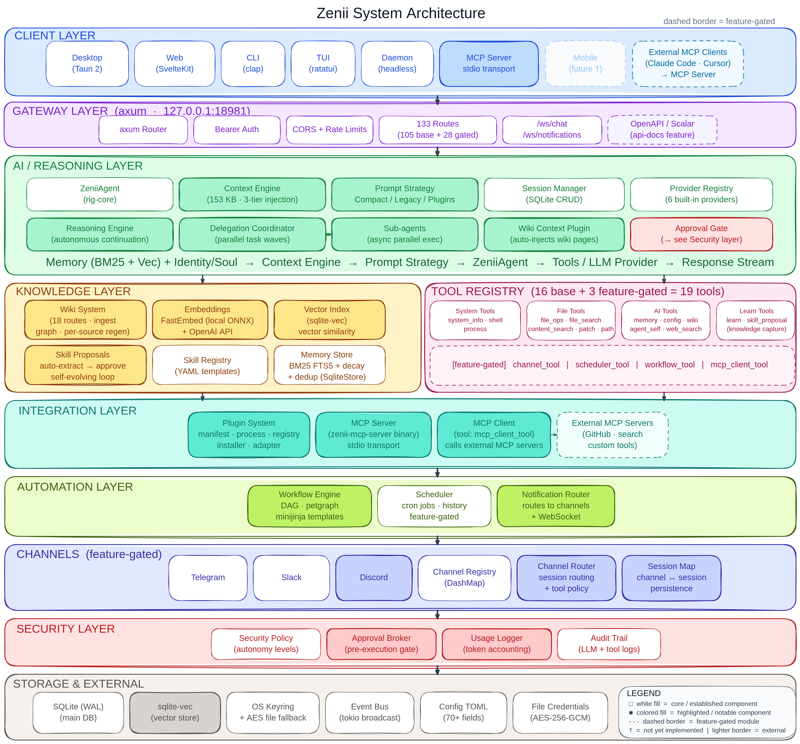

# Zenii *(zen-ee-eye)*

<p align="center">
  
</p>

<h2 align="center">One local AI backend. Every interface.</h2>

<p align="center">
  Run a daemon at <code>localhost:18981</code>. Your desktop app, CLI, TUI, scripts,
  and MCP clients share the same memory, tools, providers, channels, and scheduler — no sync, no duplication.
</p>

<p align="center">
  <a href="https://github.com/sprklai/zenii/releases/latest">
    
  </a>
  <a href="https://github.com/sprklai/zenii/actions/workflows/ci.yml">
    
  </a>
  <a href="LICENSE">
    
  </a>
  <a href="https://github.com/sprklai/zenii/actions/workflows/ci.yml">
    
  </a>
  <a href="https://github.com/sprklai/zenii/pulls">
    
  </a>
</p>

---

## Start in 60 seconds

```bash
curl -fsSL https://raw.githubusercontent.com/sprklai/zenii/main/install.sh | bash
zenii-daemon &

# Store a fact once
curl -s -X POST http://localhost:18981/memory \
  -H "Content-Type: application/json" \
  -d '{"key":"deploy","content":"Production database is on port 5434"}' >/dev/null

# Ask about it later — from a script, cron job, or another machine
curl -s -X POST http://localhost:18981/chat \
  -H "Content-Type: application/json" \
  -d '{"session_id":"ops","prompt":"What port is the production database on?"}' | jq -r '.response'
```

That is the core contract: write state once, read it from anywhere that speaks HTTP.

> [!TIP]
> **Interactive API Docs** — once the daemon is running, open
> **[http://127.0.0.1:18981/api-docs](http://127.0.0.1:18981/api-docs)**
> in your browser. You get a full Swagger-style explorer: every endpoint documented, live request
> testing, and code-snippet generation for **curl, Python, Go, TypeScript, Rust**, and more.
> No separate setup needed — it's built in.

---

## Why Zenii

Most AI tools are per-session and per-interface. You get memory in the chat UI but not in your shell script. You wire a tool to one agent and have to re-wire it to the next.

Zenii solves this with a **shared local backend**:

| Without Zenii | With Zenii |
|---|---|
| Each script manages its own AI context | One daemon holds memory for all of them |
| Tools re-implemented per project | 19 tools registered once, available everywhere |
| Provider API keys scattered across configs | One credential store, one place to rotate |
| Desktop UI and scripts drift apart | Both call the same gateway |
| MCP tools only available inside the IDE | Expose the same tools to any MCP client |

---

## Architecture

<p align="center">
  
</p>

One Rust library crate (`zenii-core`) holds all business logic. Five thin binary crates (daemon, CLI, TUI, desktop, MCP server) are shell wrappers around the same axum gateway, SQLite database, agent loop, and tool registry.

---

## What Ships Today

**Interfaces**

| Binary | Use it for |
|---|---|
| `zenii-daemon` | Local HTTP + WebSocket API server — the core of everything |
| `zenii` | Quick prompts, shell pipelines, terminal workflows |
| `zenii-tui` | Interactive terminal UI |
| `zenii-desktop` | Native Tauri desktop app |
| `zenii-mcp-server` | Expose all 19 Zenii tools to Claude Code, Cursor, VS Code |

**Capabilities**

| Domain | What it does |
|--------|-------------|
| **Memory** | Persistent semantic recall — BM25 field weighting, temporal decay, vector deduplication |
| **Karpathy LLM Wiki** | Ingest PDFs, DOCX, PPTX, XLSX, images — knowledge graph, AI query, auto-lint |
| **AI Agent** | Multi-step reasoning, tool use, streaming, delegation with human approvals |
| **Tools (19)** | Shell, file ops, web search, process control, patch, memory, wiki — one registry, every interface |
| **Providers (6+)** | OpenAI · Anthropic · Gemini · OpenRouter · Vercel AI Gateway · Ollama · any OpenAI-compatible endpoint |
| **Workflows** | TOML/YAML DAG chains — tools, conditionals, loops, parallel steps, run history, cancellation |
| **Scheduler** | Cron + interval jobs, each run as a full agent turn with access to all tools |
| **Channels** | Telegram · Discord · Slack — inbound routing, unified inbox, threaded conversations (feature-gated) |
| **MCP** | Server: expose all tools to Claude Code, Cursor, Gemini CLI, Windsurf · Client: consume external MCP servers |
| **Security** | OS keyring · AES-256-GCM encryption · surface-based permission model (CLI/desktop/TUI/MCP/API) |

---

## Karpathy LLM Wiki

Knowledge compiled at ingestion time, not re-derived at every query. Drop in a document; Zenii extracts, indexes, and links the knowledge so your agent can answer questions against it instantly.

```bash
# Ingest a runbook, spec, or doc
curl -s -X POST http://localhost:18981/wiki/ingest \
  -H "Authorization: Bearer $ZENII_TOKEN" \
  -d '{"url": "https://example.com/runbook.pdf"}'

# Query it — answers come from the compiled knowledge base
curl -s -X POST http://localhost:18981/wiki/query \
  -H "Authorization: Bearer $ZENII_TOKEN" \
  -d '{"query": "What does section 3 say about rollback?"}'
```

- Supports PDF, DOCX, PPTX, XLSX, and images via MarkItDown
- Knowledge graph with force-directed visualization in the web UI
- Queryable from any interface — CLI, desktop, or agent loop
- Auto-lint detects inconsistency and gaps across pages

Full guide: [docs.zenii.sprklai.com/wiki](https://docs.zenii.sprklai.com/wiki)

---

## MCP: Server and Client

**As MCP server** — expose all 19 Zenii tools to any agent:

```json
// .mcp.json — works with Claude Code, Cursor, Gemini CLI, Windsurf, Codex
{
  "mcpServers": {
    "zenii": {
      "command": "zenii-mcp-server",
      "args": ["--transport", "stdio"]
    }
  }
}
```

**As MCP client** — Zenii can also consume external MCP servers. Add GitHub, Postgres, Filesystem, or any custom MCP server and its tools become available in your agent loop alongside Zenii's own 19.

**[AGENT.md](AGENT.md)** — a machine-readable guide written for AI coding agents (Claude Code, Cursor, Gemini CLI, Windsurf, Codex). Drop it in your project or point your agent at it to give it a complete map of Zenii's API surface.

Full guide: [docs.zenii.sprklai.com/mcp](https://docs.zenii.sprklai.com/mcp)

---

## Workflows and Scheduler

**Workflows** — chain tools into DAGs with conditionals, loops, and parallel steps:

```yaml
# ~/.config/zenii/workflows/daily-digest.yml
name: daily-digest
steps:
  - id: search
    tool: web_search
    args: { query: "Rust ecosystem news today" }
  - id: store
    tool: memory_store
    args: { key: "digest/{{date}}", content: "{{steps.search.result}}" }
```

Run manually: `POST /workflows/daily-digest/run`

**Scheduler** — trigger any prompt or workflow on a cron schedule, executed as a full agent turn with access to all tools:

```bash
curl -s -X POST http://localhost:18981/scheduler/jobs \
  -H "Authorization: Bearer $ZENII_TOKEN" \
  -d '{"name":"daily-digest","cron":"0 8 * * *","prompt":"Run the daily-digest workflow"}'
```

Full guide: [docs.zenii.sprklai.com/workflows](https://docs.zenii.sprklai.com/workflows) · [docs.zenii.sprklai.com/scheduler](https://docs.zenii.sprklai.com/scheduler)

---

## Install

### macOS / Linux

```sh
curl -fsSL https://raw.githubusercontent.com/sprklai/zenii/main/install.sh | sh
```

Installs `zenii` (CLI) and `zenii-daemon` to `~/.local/bin`.

### Windows

Download and run the desktop installer (`.msi` or `.exe`) from
[GitHub Releases](https://github.com/sprklai/zenii/releases/latest).

For headless / CLI-only, grab `zenii.exe` and `zenii-daemon.exe` from the same page.

### Cargo

```sh
cargo install --git https://github.com/sprklai/zenii zenii zenii-daemon
```

Full platform notes: [Installation & Usage](https://docs.zenii.sprklai.com/installation-and-usage)

---

## Build from Source

Prerequisites: Rust 1.85+, Bun, SQLite development libraries.

```bash
git clone https://github.com/sprklai/zenii.git
cd zenii
cargo build --release -p zenii-daemon       # headless server
cargo build --release -p zenii-cli          # CLI client
cd crates/zenii-desktop && cargo tauri build # desktop app
```

Full setup guide: [docs/development.md](docs/development.md)

---

## Good Fit

- Local automations that need shared memory across scripts, bots, and scheduled jobs
- Developer tooling that wants a single AI backend reachable via HTTP or MCP
- Self-hosted workflows where privacy and local control matter
- Projects that want a desktop UI and a scriptable backend without maintaining two stacks
- Self-hosted on a VPS, Raspberry Pi, or Docker — runs as a systemd service or container behind nginx/Caddy ([Deployment guide](https://docs.zenii.sprklai.com/deployment))

## Zenii PiDog (Raspberry Pi) Demo

<p align="center">
  
</p>

Zenii runs on ARM — same binary, same API. Deploy it on a Raspberry Pi, attach tools, and your hardware becomes an AI-addressable endpoint over HTTP.

---

## Not a Good Fit

- Multi-user or SaaS deployments (single-user daemon, no multi-tenant auth)
- Drop-in OpenAI-compatible server (Zenii has its own API surface)
- Mobile apps (planned, not yet shipped)

---

## Docs

- [Website](https://zenii.sprklai.com)
- [Documentation](https://docs.zenii.sprklai.com)
- [Installation & Usage](https://docs.zenii.sprklai.com/installation-and-usage)
- [**Interactive API Explorer**](http://127.0.0.1:18981/api-docs) — live Swagger-style docs at `localhost:18981/api-docs` (daemon must be running)
- [API Reference](https://docs.zenii.sprklai.com/api-reference)
- [CLI Reference](https://docs.zenii.sprklai.com/cli-reference)
- [Configuration](https://docs.zenii.sprklai.com/configuration)
- [LLM Wiki](https://docs.zenii.sprklai.com/wiki)
- [Architecture](https://docs.zenii.sprklai.com/architecture)
- [AGENT.md](AGENT.md) — guide for AI coding agents
- [CHANGELOG.md](CHANGELOG.md)
- [ROADMAP.md](ROADMAP.md)

---

## Contributing

Typo fixes, tests, and focused bug fixes can go straight to a PR.
Larger feature work should start with [CONTRIBUTING.md](CONTRIBUTING.md).

If Zenii is useful to you — [star the repo](https://github.com/sprklai/zenii) and tell a developer friend.

## License

MIT
