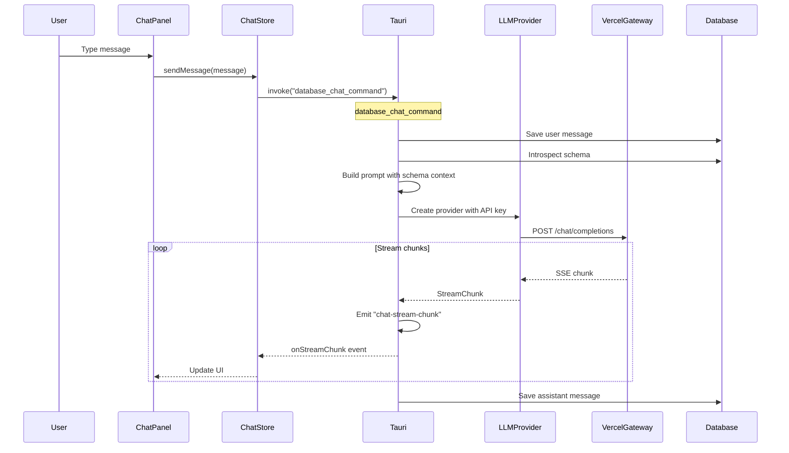
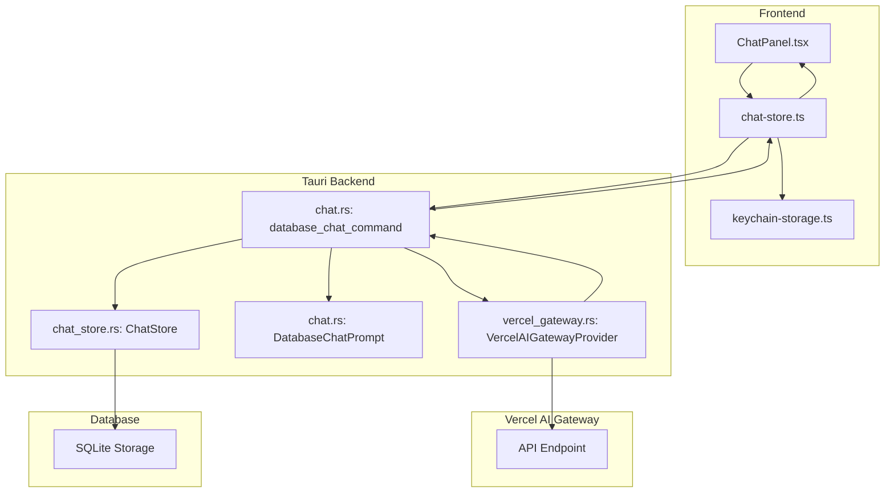

# Chat Functionality - Complete Reference

**Status**: ✅ **DOCUMENTED** (2026-01-24)

## Overview

This document explains how the chat functionality works in aiboilerplate, including which LLM library is used, how the chat flow operates, inputs/outputs, and temperature control.

---

## 1. LLM Library Used

### Primary Library: Custom Rust Implementation via Vercel AI Gateway

The application uses a **custom Rust implementation** that integrates with **Vercel AI Gateway** as the LLM provider. This provides unified access to multiple AI model providers through a single API.

**Key Files:**

- `src-tauri/src/ai/providers/vercel_gateway.rs` - Provider implementation
- `src-tauri/src/ai/types.rs` - Core LLM types
- `src-tauri/src/ai/provider.rs` - Provider trait definition

**HTTP Dependencies (Cargo.toml):**

```toml
reqwest = { version = "0.12", features = ["json", "stream"] }
eventsource-stream = "0.2"  # SSE streaming
bytes = "1.5"
```

### Why Not @ai-sdk/react?

The codebase does **NOT** use `@ai-sdk/react` directly. Instead:

- **Backend**: Custom Rust implementation with `VercelAIGatewayProvider`
- **Frontend**: Zustand stores with Tauri IPC commands
- **API Endpoint**: `https://ai-gateway.vercel.sh/v1` (default)

---

## 2. Chat Architecture

### High-Level Flow Diagram



### Component Breakdown

| Component           | File                                           | Responsibility                  |
| ------------------- | ---------------------------------------------- | ------------------------------- |
| **ChatPanel**       | `src/components/ChatPanel.tsx`                 | UI component for chat interface |
| **ChatStore**       | `src/stores/chat-store.ts`                     | Zustand store for chat state    |
| **Chat Command**    | `src-tauri/src/commands/chat.rs`               | Backend chat logic              |
| **LLM Provider**    | `src-tauri/src/ai/providers/vercel_gateway.rs` | LLM API integration             |
| **Prompt Template** | `src-tauri/src/ai/prompts/chat.rs`             | Prompt construction             |

---

## 3. Inputs to the LLM

### Message Structure

The `Message` type is defined in `src-tauri/src/ai/types.rs`:

```rust
pub struct Message {
    pub role: MessageRole,  // System, User, Assistant
    pub content: String,
}

pub enum MessageRole {
    System,
    User,
    Assistant,
}
```

### Prompt Construction (DatabaseChatPrompt)

The prompt is built in `src-tauri/src/ai/prompts/chat.rs` using the `DatabaseChatPrompt`:

```rust
pub struct DatabaseChatPrompt {
    tables: Vec<EnrichedTableMetadata>,
    relationships: Vec<Relationship>,
    history: Vec<ChatHistoryMessage>,
    user_message: String,
}
```

**Prompt Structure (in order):**

1. **System Message** - Database assistant role with guidelines
2. **Schema Context** - Full database schema information
3. **Conversation History** - Previous Q&A pairs
4. **Current User Message** - The new question

### System Prompt Template

```rust
const DATABASE_CHAT_SYSTEM_PROMPT: &str = r#"You are a knowledgeable database assistant helping users understand their database schema. Your role is to:
1. Answer questions about database structure, relationships, and data flows
2. Explain how different tables work together for business processes
3. Describe the purpose of tables, columns, and relationships
4. Help users understand data models and how information flows between entities

Guidelines:
- Be conversational but informative
- Reference specific tables, columns, and relationships when relevant
- Explain technical concepts in accessible terms
- Use examples to clarify complex relationships
..."#
```

### Schema Context Included

The schema context includes:

- **Overview Statistics**: Table count, column count, relationship count
- **All Tables**: With columns, types, constraints
- **Relationship Mappings**: Primary/foreign key relationships
- **Row Counts**: And metadata for context

---

## 4. Outputs from the LLM

### Completion Response Structure

```rust
pub struct CompletionResponse {
    pub content: String,           // Generated text
    pub model: String,             // Model used
    pub usage: Option<TokenUsage>, // Token counts
    pub finish_reason: Option<String>, // Stop reason
}

pub struct TokenUsage {
    pub prompt_tokens: u32,
    pub completion_tokens: u32,
    pub total_tokens: u32,
}
```

### Streaming Response

For real-time chat, responses are streamed:

```rust
pub struct StreamChunk {
    pub delta: String,        // Content increment
    pub is_final: bool,       // Last chunk marker
    pub finish_reason: Option<String>,
}
```

**Frontend Stream Chunk:**

```rust
#[derive(Clone, Serialize)]
pub struct ChatStreamChunk {
    pub content: String,
    pub is_final: bool,
}
```

### Server-Sent Events (SSE) Format

The Vercel AI Gateway returns data in SSE format:

```
data: {"id":"chatcmpl-...","choices":[{"delta":{"content":"Hello"},"index":0}]}

data: {"id":"chatcmpl-...","choices":[{"delta":{"content":" there"},"index":0}]}

data: {"id":"chatcmpl-...","choices":[{"delta":{"content":"!"},"index":0,"finish_reason":"stop"}]}

data: [DONE]
```

---

## 5. Temperature Control

### What is Temperature?

Temperature controls the randomness/creativity of LLM responses:

- **Low (0.0 - 0.3)**: More deterministic, focused, consistent
- **Medium (0.4 - 0.7)**: Balanced creativity and coherence
- **High (0.8 - 2.0)**: More random, creative, varied

### Temperature Values in aiboilerplate

| Use Case             | Model                   | Temperature | Max Tokens | Rationale                                        |
| -------------------- | ----------------------- | ----------- | ---------- | ------------------------------------------------ |
| **Chat Responses**   | User-selected           | `0.7`       | `2048`     | Balanced creativity for conversational responses |
| **Title Generation** | `google/gemini-3-flash` | `0.3`       | `20`       | Low temperature for concise, predictable titles  |

### Code Location

**Chat Response** (`src-tauri/src/commands/chat.rs:325-328`):

```rust
let request = CompletionRequest::new(&model, messages)
    .with_temperature(0.7)    // Balanced creativity
    .with_max_tokens(2048)    // Reasonable response length
    .with_stream(true);       // Enable streaming
```

**Title Generation** (`src-tauri/src/commands/chat.rs:410-412`):

```rust
let request = CompletionRequest::new("google/gemini-3-flash", messages)
    .with_temperature(0.3)    // Lower temperature for concise titles
    .with_max_tokens(20);
```

### Other Parameters

The `CompletionRequest` supports additional parameters:

```rust
pub struct CompletionRequest {
    pub model: String,
    pub messages: Vec<Message>,
    pub temperature: Option<f32>,    // 0.0 to 2.0
    pub max_tokens: Option<u32>,     // Token limit
    pub top_p: Option<f32>,          // Nucleus sampling (default: 1.0)
    pub stream: Option<bool>,        // Enable streaming
}
```

---

## 6. API Request Format

### HTTP Request

```http
POST https://ai-gateway.vercel.sh/v1/chat/completions
Content-Type: application/json
Authorization: Bearer {api_key}

{
  "model": "anthropic/claude-sonnet-4.5",
  "messages": [
    {"role": "system", "content": "You are a database assistant..."},
    {"role": "user", "content": "What does the users table store?"}
  ],
  "temperature": 0.7,
  "max_tokens": 2048,
  "stream": true
}
```

### HTTP Response (Streaming)

```http
Content-Type: text/event-stream

data: {"id":"chatcmpl-...","choices":[{"delta":{"content":"The "},"index":0}]}

data: {"id":"chatcmpl-...","choices":[{"delta":{"content":"users table "},"index":0}]}

data: {"id":"chatcmpl-...","choices":[{"delta":{"content":"stores..."},"index":0,"finish_reason":"stop"}]}

data: [DONE]
```

---

## 7. Supported Models

### Available Models

The application supports these models (`src-tauri/src/commands/chat.rs:42-90`):

| Provider  | Model ID                      | Display Name      |
| --------- | ----------------------------- | ----------------- |
| OpenAI    | `openai/gpt-4o`               | GPT-4o            |
| OpenAI    | `openai/gpt-4`                | GPT-4             |
| OpenAI    | `openai/gpt-3.5-turbo`        | GPT-3.5 Turbo     |
| Anthropic | `anthropic/claude-sonnet-4.5` | Claude Sonnet 4.5 |
| Anthropic | `anthropic/claude-haiku-4.5`  | Claude Haiku 4.5  |
| Anthropic | `anthropic/claude-opus-4.5`   | Claude Opus 4.5   |
| Google    | `google/gemini-2-flash`       | Gemini 2 Flash    |
| Google    | `google/gemini-3-flash`       | Gemini 3 Flash    |
| xAI       | `xai/grok-code-fast-1`        | Grok Code Fast    |

### Default Model

**Default**: `google/gemini-3-flash` (defined in `src/lib/models.ts:35`)

### Context Limits

| Model                        | Context Window   |
| ---------------------------- | ---------------- |
| Claude Sonnet/Haiku/Opus 4.5 | 200,000 tokens   |
| GPT-4o                       | 128,000 tokens   |
| Gemini 2/3 Flash             | 1,000,000 tokens |
| GPT-4                        | 8,192 tokens     |
| Grok Code Fast               | 128,000 tokens   |

---

## 8. Error Handling & Retry Logic

### Retry Mechanism

**Max Retries**: 3 attempts
**Backoff Strategy**: Exponential (1s, 2s, 4s)

**Retry Conditions:**

- ✅ Server errors (5xx)
- ✅ Rate limiting (429)
- ✅ Network failures

**No Retry:**

- ❌ Client errors (4xx except 429)
- ❌ Invalid API key (401/403)
- ❌ Model not found (404)

### Error Types

| Error           | Status  | Meaning                             |
| --------------- | ------- | ----------------------------------- |
| Invalid API Key | 401/403 | Credentials are wrong               |
| Model Not Found | 404     | Model name is incorrect             |
| Rate Limited    | 429     | Too many requests (auto-retry)      |
| Server Error    | 5xx     | Provider issue (auto-retry)         |
| Timeout         | -       | Request took too long (default 30s) |

---

## 9. Security & API Key Management

### API Key Storage

API keys are **never stored in the database**. They are stored securely using:

1. **Tauri Stronghold** - Encrypted keychain storage
2. **Frontend**: `src/lib/keychain-storage.ts`
3. **Retrieval**: `KeychainStorage.getApiKey()` before chat

### Flow

```
User enters API key
    ↓
Stored in Tauri Stronghold (OS keychain)
    ↓
Retrieved by frontend before each chat
    ↓
Passed to backend as parameter
    ↓
Used to create VercelAIGatewayProvider
    ↓
Discarded after use (not cached)
```

### Key Files

- `src/lib/keychain-storage.ts` - Keychain operations
- `src/stores/llm.ts` - LLM configuration store
- `src-tauri/src/commands/llm.rs` - LLM configuration commands

---

## 10. Chat Command Reference

### database_chat_command

**Location**: `src-tauri/src/commands/chat.rs:252-395`

**Parameters:**

```typescript
{
  workspace_id: string;
  session_id: string;
  message: string;
  model: string;
  api_key: string;
}
```

**Returns:**

```typescript
Result<void, string>; // Success or error message
```

**Flow:**

1. Save user message to database
2. Get workspace and database connection
3. Introspect database schema
4. Build chat prompt with schema context
5. Create LLM provider with API key
6. Stream response from Vercel AI Gateway
7. Emit chunks to frontend via `chat-stream-chunk` event
8. Save assistant message to database
9. Generate title if first exchange (async background)

### Other Chat Commands

| Command                           | Purpose                     |
| --------------------------------- | --------------------------- |
| `get_available_models_command`    | List available models       |
| `create_chat_session_command`     | Create new chat session     |
| `get_chat_session_command`        | Get session with messages   |
| `list_chat_sessions_command`      | List sessions for workspace |
| `delete_chat_session_command`     | Delete a session            |
| `toggle_chat_bookmark_command`    | Toggle bookmark status      |
| `update_chat_title_command`       | Update session title        |
| `create_chat_tag_command`         | Create a tag                |
| `list_chat_tags_command`          | List all tags               |
| `add_tag_to_session_command`      | Add tag to session          |
| `remove_tag_from_session_command` | Remove tag from session     |

---

## 11. Frontend Integration

### Chat Store (Zustand)

**Location**: `src/stores/chat-store.ts`

**Key Function: sendMessage**

```typescript
async sendMessage(message: string, model: string): Promise<void> {
  // 1. Get API key from keychain
  const apiKey = await KeychainStorage.getApiKey();

  // 2. Invoke Tauri command
  await invoke("database_chat_command", {
    workspace_id: this.workspaceId,
    session_id: this.sessionId,
    message,
    model,
    api_key: apiKey,
  });

  // 3. Listen for stream chunks
  // (handled by onStreamChunk listener)
}
```

### Stream Event Listener

```typescript
// Listen to streaming events
const unlisten = await listen("chat-stream-chunk", (event) => {
  const chunk = event.payload as ChatStreamChunk;
  // Update UI with chunk.content
  if (chunk.is_final) {
    // Finished streaming
  }
});
```

---

## 12. Summary Diagram



---

## Related Documentation

- [Phase 2.1: LLM Provider Abstraction](PHASE_2.1_LLM_PROVIDER_ABSTRACTION.md) - Core types and traits
- [Phase 2.2: Vercel AI Gateway Provider](PHASE_2.2_VERCEL_AI_GATEWAY_PROVIDER.md) - Provider implementation
- [Phase 2.3: Prompt Template System](PHASE_2.3_PROMPT_TEMPLATE_SYSTEM.md) - Prompt construction
- [Phase 4.6: LLM Commands](PHASE_4.6_LLM_COMMANDS.md) - Configuration commands

---

**Document Updated**: 2026-01-24
