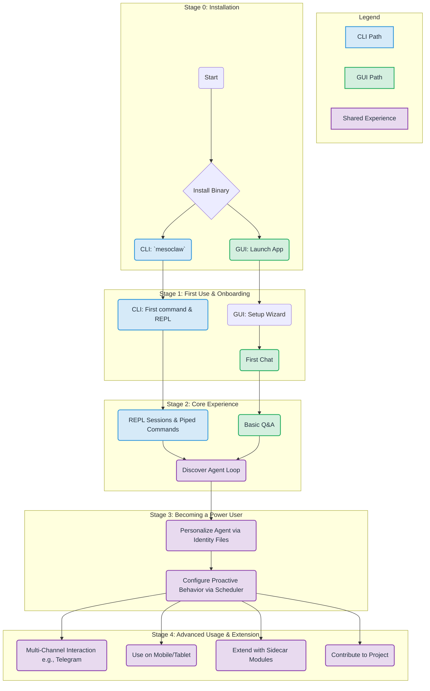
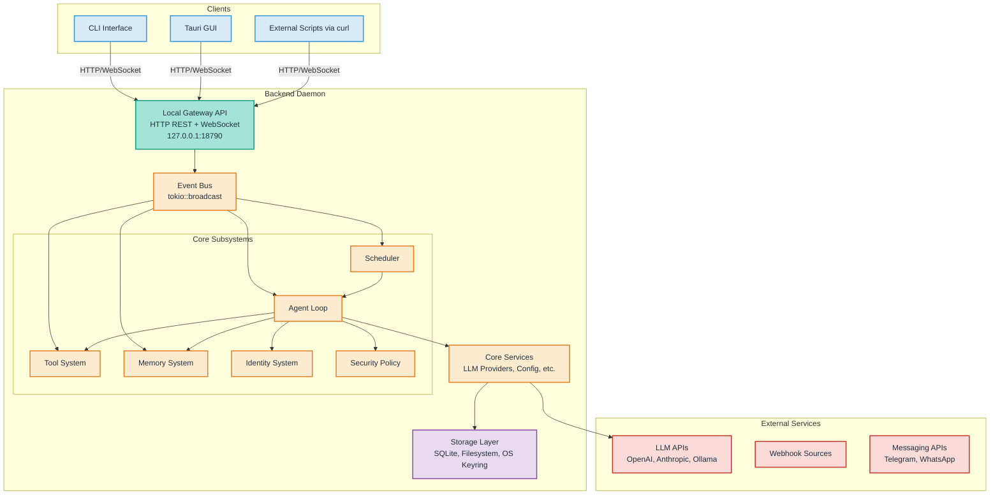
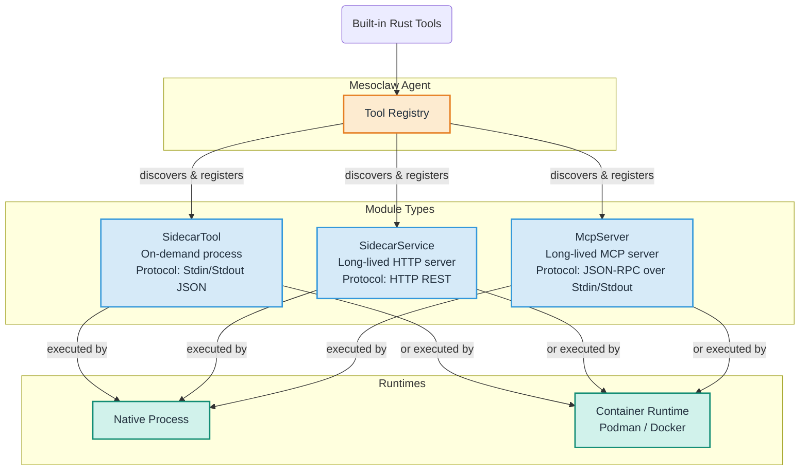
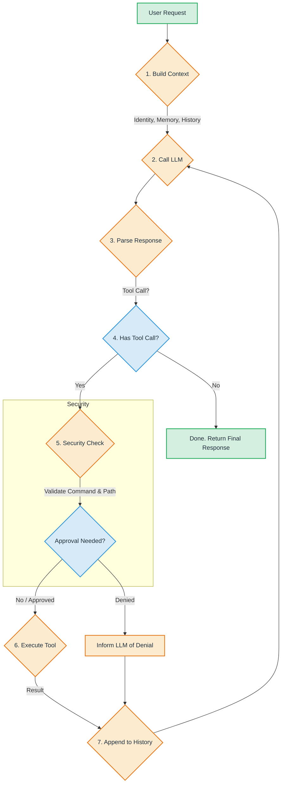
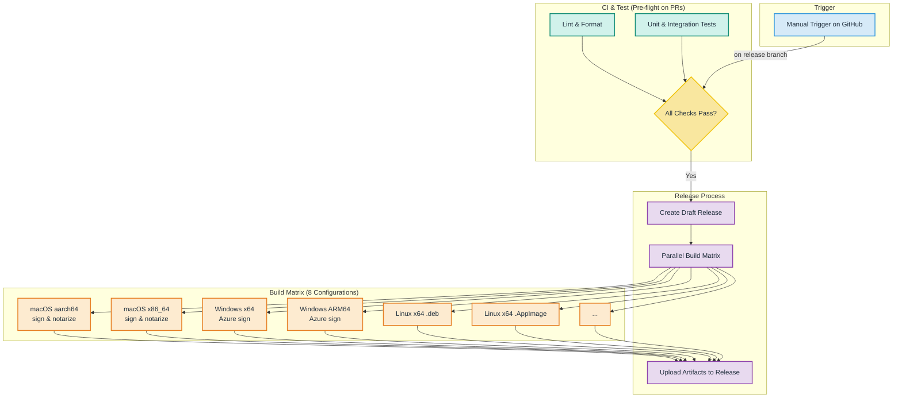

# Generated Diagrams for Mesoclaw

> This document contains programmatically generated diagrams based on the project's documentation, including user journeys and updated architecture visuals.

---

## 1. User Journey

This diagram illustrates the two primary user paths: the developer-focused CLI path and the user-friendly GUI path. It shows how users onboard, discover features, and progress to power usage.



---

## 2. High-Level System Architecture

This is a refined version of the system overview, emphasizing the separation between the frontend, the gateway, and the backend core.



---

## 3. Sidecar Modularity Architecture

This diagram shows how Mesoclaw extends its toolset using Sidecar Modules, supporting native scripts, containerized environments, and the MCP protocol.



---

## 4. CLI-First Gateway Architecture

This diagram details the CLI-first approach, where both the CLI and the GUI are clients to a central, local daemon.

```mermaid
graph TD
    subgraph "User Interfaces"
        CLI[CLI (mesoclaw)]:::client
        GUI[Tauri GUI (mesoclaw-desktop)]:::client
    end

    subgraph "Daemon & Gateway"
        Daemon[Daemon Process]:::daemon

        subgraph "Gateway"
            REST[HTTP REST API]:::gateway_api
            WS[WebSocket API]:::gateway_api
        end
    end

    subgraph "Core Logic (lib.rs)"
        Core[All Business Logic<br>Agent, Memory, Providers, etc.]:::core
    end

    CLI -- starts or connects to --> Daemon;
    GUI -- embeds and starts --> Daemon;

    Daemon -- exposes --> REST;
    Daemon -- exposes --> WS;
    Daemon -- contains --> Core;

    CLI -- communicates via --> REST & WS;
    GUI -- communicates via --> REST & WS;

    classDef client fill:#D6EAF8,stroke:#3498DB,stroke-width:2px,color:#212F3D;
    classDef daemon fill:#FDEBD0,stroke:#E67E22,stroke-width:2px,color:#212F3D;
    classDef gateway_api fill:#A3E4D7,stroke:#16A085,stroke-width:2px,color:#212F3D;
    classDef core fill:#E8DAEF,stroke:#8E44AD,stroke-width:2px,color:#212F3D;
```

---

## 5. Data Flow: Multi-Turn Agent Loop

This diagram shows the iterative process the agent follows to understand a request, use tools, and arrive at a final answer.



---

## 6. Event Bus Architecture

The Event Bus is the central nervous system of the backend, allowing subsystems to communicate asynchronously.

```mermaid
graph TD
    subgraph "Event Producers"
        AgentLoop[Agent Loop]
        Scheduler
        ChannelManager[Channel Manager]
        MemorySystem[Memory System]
    end

    subgraph "Central Bus"
        EventBus[Event Bus<br>(tokio::broadcast)]
    end

    subgraph "Event Consumers"
        TauriBridge[Tauri Bridge<br>to Frontend]
        AgentLoopConsumer[Agent Loop]
        NotificationService[Notification Service]
        AuditLogger[Audit Logger]
    end

    AgentLoop -- Publishes: AgentToolStart, AgentToolResult, ApprovalNeeded --> EventBus;
    Scheduler -- Publishes: HeartbeatTick, CronFired --> EventBus;
    ChannelManager -- Publishes: ChannelMessage --> EventBus;
    MemorySystem -- Publishes: MemoryStored, MemoryRecalled --> EventBus;

    EventBus -- Subscribes & Forwards --> TauriBridge;
    EventBus -- Subscribes to Responses --> AgentLoopConsumer;
    EventBus -- Subscribes to Alerts --> NotificationService;
    EventBus -- Subscribes to All --> AuditLogger;

    style EventBus fill:#E8DAEF,stroke:#8E44AD,stroke-width:4px,color:#212F3D;
```

---

## 7. Security Architecture Layers

This diagram breaks down the six layers of defense that protect the user and their system from unintended actions.

```mermaid
graph LR
    subgraph "Security Layers"
        direction TB
        L1[<b>Layer 1: Credential Security</b><br>OS Keyring (keyring crate)<br>API keys never touch disk]:::l1
        L2[<b>Layer 2: Command Validation</b><br>3 Autonomy Levels<br>Risk Classification (Low/Med/High)]:::l2
        L3[<b>Layer 3: Filesystem Sandboxing</b><br>Workspace-only access<br>Path traversal prevention]:::l3
        L4[<b>Layer 4: Injection Protection</b><br>Block backticks, redirects, pipes]:::l4
        L5[<b>Layer 5: Rate Limiting</b><br>Sliding window (e.g., 20 actions/hour)]:::l5
        L6[<b>Layer 6: Audit Trail</b><br>All tool executions logged]:::l6
    end

    L1 --> L2 --> L3 --> L4 --> L5 --> L6

    classDef l1 fill:#FADBD8,stroke:#C0392B,stroke-width:2px,color:#000;
    classDef l2 fill:#F5B7B1,stroke:#C0392B,stroke-width:2px,color:#000;
    classDef l3 fill:#EC7063,stroke:#C0392B,stroke-width:2px,color:#000;
    classDef l4 fill:#E74C3C,stroke:#C0392B,stroke-width:2px,color:#FFF;
    classDef l5 fill:#CB4335,stroke:#C0392B,stroke-width:2px,color:#FFF;
    classDef l6 fill:#943126,stroke:#C0392B,stroke-width:2px,color:#FFF;
```

---

## 8. CI/CD Release Pipeline

This illustrates the automated pipeline for building, testing, and releasing Mesoclaw across all supported platforms.


