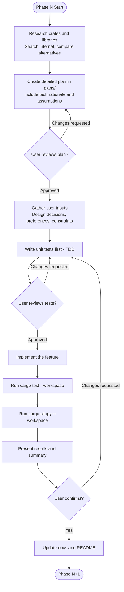

# MesoClaw Implementation Phases

## Phase Gate Protocol

Every implementation phase follows this strict workflow. No phase proceeds without user confirmation at each gate.

## Phase Checklist Template

Each phase has **3 user gates** (plan, tests, completion). All must pass before proceeding.

### Gate 1: Planning
- [ ] **Dependency research done** -- searched internet for candidate crates/libraries, compared alternatives
- [ ] **Tech selection rationale documented** -- for each dependency: why chosen, what was rejected, binary size impact, maintenance status
- [ ] **Assumptions logged** -- all assumptions listed with rationale, flagged for user confirmation
- [ ] **Lightweight check** -- verified dependency trees are minimal, no unnecessary bloat
- [ ] **Detailed plan created** -- `plans/phaseN_*.md` with scope, API signatures, data models, dependencies, rationale
- [ ] **User inputs gathered** -- design decisions, preferences, constraints documented in plan
- [ ] **User approved plan** -- explicit approval before any code is written

### Gate 2: Tests (TDD)
- [ ] **Unit tests written first** -- test files exist before implementation code
- [ ] **Test coverage plan** -- success paths, failure paths, edge cases identified
- [ ] **User reviewed tests** -- explicit approval of test design before implementation

### Gate 3: Completion
- [ ] **Implementation complete** -- all code for the phase is written
- [ ] **`cargo test --workspace` passes** -- zero failures
- [ ] **`cargo clippy --workspace` passes** -- zero warnings
- [ ] **Phase summary provided** -- what was built, what changed, architecture impact
- [ ] **Documentation updated** -- `docs/` and `README.md` reflect changes with Mermaid diagrams
- [ ] **User confirmation received** -- explicit "proceed" before next phase

## Phase Timeline

```mermaid
gantt
    title MesoClaw Implementation Phases (22 Steps / 11 Phases)
    dateFormat X
    axisFormat %s

    section Foundation
    Phase 1 - Core Foundation           :done, p1, 0, 1
    section AI
    Phase 2 - AI Integration            :p2, after p1, 1
    section Gateway
    Phase 3 - Gateway Server            :p3, after p2, 1
    section Intelligence
    Phase 4 - Agent Intelligence         :p4, after p3, 1
    section Binaries
    Phase 5 - Binary Shells             :p5, after p4, 1
    section Frontend
    Phase 6 - Frontend                  :p6, after p5, 1
    section Desktop/Mobile
    Phase 7 - Desktop & Mobile          :p7, after p6, 1
    section Channels
    Phase 8 - Channels & Scheduler      :p8, after p7, 1
    section TUI/Cross
    Phase 9 - TUI & Cross-Compilation   :p9, after p8, 1
    section CI/CD
    Phase 10 - CI/CD & Quality          :p10, after p9, 1
    section Docs
    Phase 11 - Documentation & Community :p11, after p10, 1
```

## Phase Details

### Phase 1: Core Foundation — `[COMPLETE]`

**Steps 1--4: Scaffold, Error+Config, DB, Event Bus**

- Error types (`MesoError` enum with `thiserror`) -- 16 variants with `From` impls
- Configuration system (TOML-based) -- `directories` crate for OS-specific paths (`com.sprklai.mesoclaw`)
- Database layer (rusqlite + WAL + spawn_blocking) -- 4 tables (sessions, messages, providers, schedule_jobs)
- Event bus (`tokio::sync::broadcast`) -- `EventBus` trait + `TokioBroadcastBus` with 12 event variants
- Daemon wiring -- config loading, tracing init, DB init, migration runner
- **Tests**: 16 unit tests, all passing. Zero clippy warnings.
- **Plan**: [plans/phase1_core_foundation.md](../plans/phase1_core_foundation.md)
- **Test plan**: [tests/phase1_core_foundation.md](../tests/phase1_core_foundation.md)

---

### Phase 2: AI Integration — `[NOT STARTED]`

**Step 5: Memory System**
- `Memory` trait + `SqliteMemoryStore` with FTS5 + BM25 ranking
- `InMemoryStore` for tests
- Embedding storage and retrieval via sqlite-vec

**Step 6: Security + Credentials**
- `SecurityPolicy` and `AutonomyLevel` definitions
- `CredentialStore` trait with `KeyringStore` (production) and `InMemoryStore` (tests)
- zeroize for sensitive data in memory

**Step 7: Tool Definitions**
- `web_search` via `websearch` crate
- `system_info` via `sysinfo` crate
- `file_search` via `ignore` crate
- `shell` -- command execution with security policy enforcement
- `file_read` / `file_write` -- filesystem access with sandboxing
- `patch` -- apply diffs to files
- `process` -- process management

- **Tests**: memory CRUD, FTS queries, credential store/retrieve, tool execution, security policy enforcement
- **Plan**: [plans/phase2_ai_integration.md](../plans/phase2_ai_integration.md)

---

### Phase 3: Gateway Server — `[NOT STARTED]`

**Step 8: AI Agent**
- Rig integration -- `AgentBuilder` wrapper for multi-provider support
- Session management (create, resume, list)
- Streaming responses via SSE/WS

**Step 9: Gateway Server**
- axum HTTP server at `127.0.0.1:18981`
- REST endpoints (CRUD for sessions, messages, memory, config)
- WebSocket handler for real-time streaming
- Auth middleware (token-based)
- `rust-embed` for serving static frontend assets

**Step 10: Boot Sequence**
- `init_services()` function producing a `Services` bundle
- Ordered startup: config -> DB -> event bus -> memory -> agent -> gateway

- **Tests**: endpoint responses, WS connection, message routing, agent flow, boot sequence ordering
- **Plan**: [plans/phase3_gateway_server.md](../plans/phase3_gateway_server.md)

---

### Phase 4: Agent Intelligence — `[NOT STARTED]`

**Step 10a: Soul / Persona System**
- Markdown + YAML frontmatter persona definitions
- `SoulLoader` for parsing persona files (comrak + Tera templating)
- Hot-reload support for persona changes without restart

**Step 10b: Skills / Prompt Templates**
- `SkillRegistry` for managing prompt templates
- Parameter substitution in templates
- Built-in skill overrides for customization

**Step 10c: User Profile + Progressive Learning**
- `UserLearner` -- learns preferences and patterns from interactions
- Observation storage and retrieval
- Privacy controls for what is learned and retained

- **Tests**: persona loading/switching, skill registry, template substitution, user learning, privacy controls
- **Plan**: [plans/phase4_agent_intelligence.md](../plans/phase4_agent_intelligence.md)

---

### Phase 5: Binary Shells — `[NOT STARTED]`

**Step 11: Daemon Binary**
- ~50 lines: config -> init_services() -> gateway -> block on signal
- Graceful shutdown handling

**Step 12: CLI Binary**
- clap-based command structure:
  - `daemon` -- start/stop the daemon
  - `chat` -- interactive chat session
  - `run` -- execute a single prompt
  - `memory` -- search/add/remove memories
  - `config` -- view/edit configuration
  - `key` -- manage API keys
  - `schedule` -- manage scheduled jobs

- **Tests**: CLI arg parsing, daemon startup/shutdown, command execution
- **Plan**: [plans/phase5_binary_shells.md](../plans/phase5_binary_shells.md)

---

### Phase 6: Frontend — `[NOT STARTED]`

**Step 13: Svelte 5 Frontend**
- SvelteKit + shadcn-svelte + paraglide-js (i18n)
- 8 routes: home, chat, chat/[id], memory, settings, settings/providers, settings/persona, schedule
- 7 stores: session, messages, memory, config, providers, theme, i18n
- ~40 components: chat interface, message bubbles, markdown rendering, settings panels, etc.
- WebSocket integration for real-time streaming
- Max 1 `$effect` per Svelte component

- **Tests**: frontend build, component rendering, store reactivity, WS connection
- **Plan**: [plans/phase6_frontend.md](../plans/phase6_frontend.md)

---

### Phase 7: Desktop & Mobile — `[NOT STARTED]`

**Step 14: Desktop Binary**
- Tauri 2 shell wrapping the Svelte frontend
- Window management IPC commands
- `TauriBridge` for native OS integration (notifications, file dialogs, system tray)

**Step 14b: Mobile App**
- Tauri 2 iOS + Android targets
- In-process gateway (no separate daemon needed)
- Responsive layout adapting to mobile screens

- **Tests**: Tauri command invocation, frontend build, window management, mobile build
- **Plan**: [plans/phase7_desktop_mobile.md](../plans/phase7_desktop_mobile.md)

---

### Phase 8: Channels & Scheduler — `[NOT STARTED]`

**Step 15: Channels**
- `openclaw-channels` integration
- `ChannelRegistry` for managing external channels (Slack, Discord, etc.)
- Feature-gated behind `channels` feature flag

**Step 16: Scheduler**
- Cron job definitions and execution
- Feature-gated behind `scheduler` feature flag
- Persistent job storage in SQLite

- **Tests**: channel registration/dispatch, cron parsing, job execution, feature flag isolation
- **Plan**: [plans/phase8_channels_scheduler.md](../plans/phase8_channels_scheduler.md)

---

### Phase 9: TUI & Cross-Compilation — `[NOT STARTED]`

**Step 17: TUI Binary**
- ratatui + crossterm
- Four-pane layout: sessions list, chat, input, status bar
- Vim-style keybindings

**Step 18: Cross-Compilation**
- ARM daemon build for Raspberry Pi
- Cross-compilation toolchain setup
- Minimal binary size for embedded targets

- **Tests**: TUI rendering, keybinding dispatch, cross-compilation smoke test
- **Plan**: [plans/phase9_tui_cross.md](../plans/phase9_tui_cross.md)

---

### Phase 10: CI/CD & Quality — `[NOT STARTED]`

**Step 19: GitHub Actions CI/CD**
- PR checks: cargo test, clippy, fmt, frontend lint
- Release workflow: build all binaries per platform
- `tauri-action` for desktop installer packaging
- Mobile build pipeline (iOS + Android)

**Step 20: CI Quality Gates**
- `cargo-audit` for dependency vulnerability scanning
- `grep` checks for banned patterns (std::sync::Mutex in async, block_on, println!)
- Frontend lint + type checking

- **Tests**: CI config validation, quality gate script execution
- **Plan**: [plans/phase10_cicd_quality.md](../plans/phase10_cicd_quality.md)

---

### Phase 11: Documentation & Community — `[NOT STARTED]`

**Step 21: Documentation**
- README with badges, screenshots, quick-start
- Architecture docs with Mermaid diagrams
- Gateway API reference
- Configuration reference
- Channels integration guide
- Deployment guide (native, Docker, Raspberry Pi)
- Development guide (contributing setup, testing, building)

**Step 22: Community**
- CONTRIBUTING.md
- CODE_OF_CONDUCT.md
- Issue templates (bug report, feature request)
- PR template
- SECURITY.md (vulnerability disclosure)

- **Tests**: link validation, markdown lint
- **Plan**: [plans/phase11_docs_community.md](../plans/phase11_docs_community.md)
