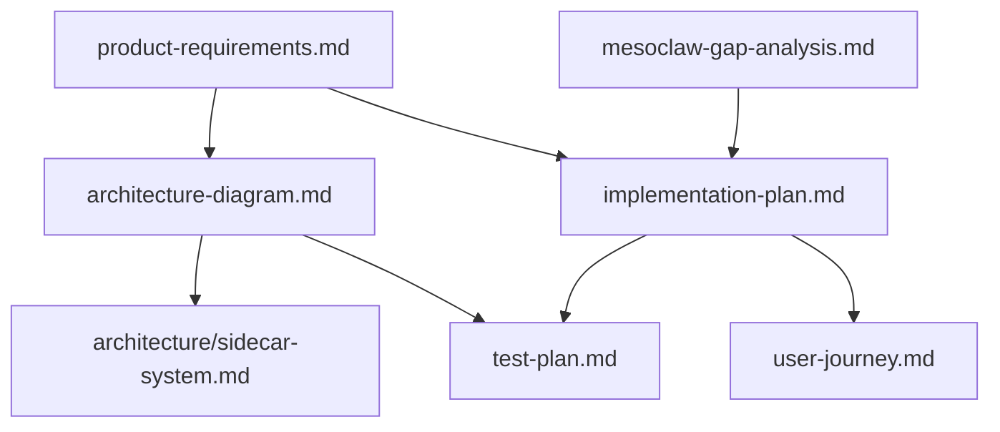

# MesoClaw Documentation & Code Refactoring Design

**Date:** 2026-02-16
**Author:** System Design (Claude Code)
**Status:** Approved
**Approach:** Layered Documentation-First Cleanup

---

## Executive Summary

This refactoring transforms MesoClaw from its legacy "database comprehension desktop application" identity to its current "lightweight privacy-first desktop AI agent" reality. The work consolidates scattered documentation, removes obsolete code, and establishes single sources of truth for all architectural concepts.

**Key Changes:**
- Update all CLAUDE.md files to reflect AI agent identity
- Consolidate sidecar architecture to single source of truth
- Migrate from Diesel ORM to rusqlite
- Remove legacy database provider code (PostgreSQL, MySQL, MongoDB)
- Add documentation navigation and version mapping
- Fix broken test imports

---

## Scope & Goals

### Success Criteria

- ✅ All documentation describes MesoClaw as an AI agent (not database tool)
- ✅ Zero references to legacy database providers (PostgreSQL, MySQL, MongoDB)
- ✅ Single source of truth for sidecar architecture (`docs/architecture/sidecar-system.md`)
- ✅ Diesel completely removed, rusqlite only
- ✅ All broken test imports fixed or removed
- ✅ Gateway consistently on 127.0.0.1:18790
- ✅ Clear documentation navigation via `docs/README.md`
- ✅ Implementation plan has version mapping and phase acceptance criteria

### Out of Scope

- Actual implementation of missing features (just documentation)
- Code refactoring beyond removing legacy database code
- Performance optimization
- New feature development

---

## Phase 1: Core Identity (CLAUDE.md Updates)

**Objective:** Establish consistent project identity across all CLAUDE.md files.

### Files to Update (4 total)

#### 1. `/CLAUDE.md` (Root - highest priority)

**Current State:**
```markdown
**MesoClaw** is an AI-powered database comprehension desktop application
```

**New State:**
```markdown
**MesoClaw** is a lightweight privacy-first desktop AI agent built with Tauri 2
```

**Sections to Remove:**
- "Adding a New Database Provider" (lines 98-105)
- Database Provider architecture diagram references (PostgreSQL, MySQL, MongoDB)
- "Database Layer" from architecture diagram (lines 66-72)
- Database-specific commands (database_commands.rs, schema_commands.rs, explanation_commands.rs)

**Sections to Update:**
- **Tech stack:** Remove "Diesel ORM", add "rusqlite" for local storage
- **Architecture diagram:** Replace database layer with "Agent Loop, Memory System, Tool Registry"
- **Testing:** Remove reference to "120 tests" (will be different after cleanup)

#### 2. `.claude/CLAUDE.md` (Project-specific standards)

**Current State:** Correctly describes AI integration and skills system

**Updates:**
- Ensure consistency with root CLAUDE.md project description
- Verify no legacy database provider references
- Update "What's Included" section to match new architecture

#### 3. `src/CLAUDE.md` (Frontend standards)

**No changes needed** - Already focuses on React/TypeScript standards only

#### 4. `src-tauri/CLAUDE.md` (Backend standards)

**Sections to Remove:**
- All DatabaseProvider trait examples
- SSH tunneling patterns
- Database migration instructions (Diesel-specific)

**Sections to Update:**
- Replace Diesel examples with rusqlite examples
- Update "Common Patterns" to focus on AI provider trait pattern

### Consistency Rules

**All CLAUDE.md files must use:**
- **Project description:** "MesoClaw is a lightweight privacy-first desktop AI agent built with Tauri 2"
- **Tech stack:** "Rust 2024 + Tauri 2 + rusqlite + Tokio async runtime"
- **Zero mentions of:** PostgreSQL, MySQL, MongoDB, Diesel, database providers, schema introspection, workspace management

---

## Phase 2: Architecture Consolidation

**Objective:** Create single sources of truth for architecture concepts and establish documentation navigation.

### 2.1 Sidecar Architecture Consolidation

#### Create: `docs/architecture/sidecar-system.md` (NEW)

**Purpose:** Single source of truth for sidecar module system architecture.

**Consolidate from these 10 files:**
1. `docs/plans/2026-02-16-sidecar-modularity-design.md` (primary source - most complete)
2. `docs/architecture-diagram.md` (overview section)
3. `docs/implementation-plan.md` (implementation tasks)
4. `docs/product-requirements.md` (FR-18 Sidecar Module System)
5. `docs/test-plan.md` (sidecar testing section)
6. `docs/mesoclaw-gap-analysis.md` (sidecar recommendations)
7. `docs/user-journey.md` (Stage 10)
8. `docs/generated-diagrams.md` (sidecar diagrams)
9. `docs/architecture/tauri-plugin-baseline.md` (plugin vs sidecar)
10. `docs/plans/2026-02-16-doc-reconciliation-draft.md` (reconciliation notes)

**Document Structure:**

```markdown
# Sidecar Module System Architecture

## Overview
Purpose, design philosophy, security-first approach

## Module Types
- **SidecarTool**: On-demand stdin/stdout JSON communication
- **SidecarService**: Long-lived HTTP REST services with health checks
- **McpServer**: MCP JSON-RPC protocol for Model Context Protocol

## Container Runtime Abstraction
- Docker/Podman auto-detection (prefers rootless Podman)
- Native fallback for non-containerized modules
- ContainerRuntime trait (pull_image, run, stop, exec)

## Security Model
Six-layer defense adapted from ZeroClaw:
1. OS Keyring credential storage
2. SecurityPolicy validation (3 autonomy levels)
3. Filesystem sandboxing (blocked paths, traversal prevention)
4. Injection protection (backticks, $(), ${}, pipes)
5. Rate limiting (sliding window, configurable)
6. Comprehensive audit logging

## Manifest Format (TOML)
Schema, required fields, security constraints, validation rules

## Gateway API Integration
- `/api/v1/modules/*` endpoints
- WebSocket events for lifecycle notifications
- Module start/stop/health operations

## MCP Protocol Support
- initialize, tools/list, tools/call JSON-RPC methods
- Automatic tool discovery and registration
- Composio.dev zero-configuration integration

## Implementation Roadmap
Reference to implementation-plan.md Phase 2.8-2.10

## Testing Strategy
Reference to test-plan.md sidecar test wave
```

#### Update other 9 files

Replace detailed sidecar sections with:

```markdown
## Sidecar Module System
See [docs/architecture/sidecar-system.md](../architecture/sidecar-system.md) for complete architecture.
```

### 2.2 Architecture Diagram Updates

**File:** `docs/architecture-diagram.md`

**Changes:**

1. **Gateway Port:** Confirm "127.0.0.1:18790" throughout (fix any 18789 references)

2. **Security Section:** Add "Autonomy Levels" subsection:
```markdown
### Autonomy Levels

MesoClaw implements three security autonomy levels controlling agent permissions:

- **ReadOnly**: Only read operations allowed (ls, cat, grep, find, etc.)
  - Zero risk operations
  - No approval required
  - Suitable for exploration and analysis

- **Supervised**: Approval required for medium/high risk operations
  - Medium risk: git commit, npm install, file writes
  - High risk: rm, sudo, curl, wget
  - User approval via desktop notification (never in messaging channels)
  - Default mode for new users

- **Full**: All operations with rate limiting
  - Rate limit: 20 actions/hour (sliding window, configurable)
  - Audit logging for all operations
  - Suitable for trusted autonomous operation
  - User must explicitly enable

See [Security Policy](product-requirements.md#fr-6-security-policy) for complete risk classification.
```

3. **Storage Section:** Update database default:
```markdown
**Default**: SQLite (`~/.mesoclaw/app.db`) using rusqlite

**Future alternatives under consideration:**
- PostgreSQL for remote/shared memory stores
- Custom vector databases for embeddings
- Hybrid approaches (SQLite + vector store)
```

### 2.3 Documentation Navigation Guide

#### Create: `docs/README.md` (NEW)

**Purpose:** Top-level documentation navigation and dependency mapping.

**Structure:**

```markdown
# MesoClaw Documentation

Navigation guide for the MesoClaw documentation directory.

## Quick Navigation

### 📋 Planning & Requirements

- **[Product Requirements](product-requirements.md)** - Complete feature specifications with 18 functional requirement categories
- **[Implementation Plan](implementation-plan.md)** - 8 phases, 49 tasks, version mapping, acceptance criteria
- **[Gap Analysis](mesoclaw-gap-analysis.md)** - Feature parity analysis vs. claw ecosystem projects

### 🏗️ Architecture

- **[System Architecture](architecture-diagram.md)** - Complete system design with CLI-first daemon/gateway pattern
- **[Sidecar System](architecture/sidecar-system.md)** - Module extensibility architecture (single source of truth)
- **[Claw Ecosystem Analysis](claw-ecosystem-analysis.md)** - Comparative analysis of OpenClaw, PicoClaw, IronClaw, ZeroClaw

### 🧪 Testing & Quality

- **[Test Plan](test-plan.md)** - Comprehensive test strategy with phase-based wave testing
- **[Build Optimizations](BUILD_OPTIMIZATIONS.md)** - Binary size reduction techniques

### 👤 User Experience

- **[User Journey](user-journey.md)** - 10 stages from CLI installation through contribution

### 📁 Specialized Documentation

- **[architecture/](architecture/)** - Detailed architecture documents (sidecar system, Tauri plugins)
- **[plans/](plans/)** - Design documents organized by date
- **[features/](features/)** - Feature-specific documentation
- **[security/](security/)** - Security guidelines and threat models
- **[ui-fixes/](ui-fixes/)** - UI improvement tracking
- **[ux/](ux/)** - UX design documents
- **[accessibility/](accessibility/)** - Accessibility standards

## Document Dependencies



## Key Concepts

### CLI-First Architecture

MesoClaw uses a daemon/gateway pattern where:
- **Daemon**: Long-running background process (`bin/desktop.rs` or `bin/cli.rs`)
- **Gateway**: HTTP REST + WebSocket API on `127.0.0.1:18790`
- **Clients**: CLI (rustyline REPL) and Tauri GUI both connect to same gateway
- Feature parity guaranteed between CLI and GUI

### Event-Driven Design

All subsystems communicate via EventBus (tokio::broadcast):
- Agent Loop: AgentToolStart, AgentToolResult, ApprovalNeeded
- Scheduler: HeartbeatTick, CronFired
- Channels: ChannelMessage
- Memory: MemoryStored, MemoryRecalled

### Security-First

Six-layer security model:
1. OS Keyring (credentials never on disk)
2. SecurityPolicy (3 autonomy levels)
3. Filesystem sandboxing
4. Injection protection
5. Rate limiting
6. Audit logging

## Version History

See [Implementation Plan § Version Mapping](implementation-plan.md#version-mapping) for release roadmap from v0.5 (Slim Down) to v1.2 (Mobile Distribution).

## Contributing

For code standards, see:
- Root: `/CLAUDE.md` - Project overview
- Frontend: `/src/CLAUDE.md` - React/TypeScript standards
- Backend: `/src-tauri/CLAUDE.md` - Rust standards
```

---

## Phase 3: Plans & Tests Updates

**Objective:** Enhance implementation plan and test plan with version mapping, acceptance criteria, and Tauri v2 testing guidance.

### 3.1 Implementation Plan Updates

**File:** `docs/implementation-plan.md`

#### Add: Version Mapping Table

**Insert after introduction, before Phase 0:**

```markdown
## Version Mapping

| Version | Phase(s) | Key Features | Status |
|---------|----------|--------------|--------|
| v0.5 | Phase 0 | Slim Down: Provider consolidation, Tera templates, responsive foundation | Planned |
| v0.6 | Phase 1 | Foundation: Binary optimization, ReliableProvider | Planned |
| v0.7 | Phase 2.1-2.5 | Core Infrastructure: EventBus, Tools, Security, Identity, Gateway | Planned |
| v0.8 | Phase 2.6-2.10 | Advanced Infrastructure: CLI, Frontend migration, Sidecar system, MCP | Planned |
| v0.9 | Phase 3 | Agent Intelligence: AgentLoop, Memory, Daily summaries | Planned |
| v1.0 | Phase 4 | Scheduler: Heartbeat, cron, backoff | Release Candidate |
| v1.1 | Phase 5-6 | Channels: Telegram, webhooks, responsive UI refinement | Stable |
| v1.2 | Phase 7-8 | Mobile: iOS/Android builds, CI/CD, TestFlight/Play Console | Production |

### Release Criteria

Each version requires:
- ✅ All phase tasks completed
- ✅ Phase acceptance tests pass
- ✅ No blocking bugs
- ✅ Documentation updated
- ✅ Code review approved (for major versions)
```

#### Add: Phase Acceptance Criteria Template

**Insert after each phase header (Phases 0-8):**

```markdown
### Phase N Acceptance Criteria

**Completion Definition:**
- [ ] All Phase N tasks completed (N.1 through N.X)
- [ ] Phase N wave tests pass (see test-plan.md § Phase N Tests)
- [ ] No regression in previous phase functionality
- [ ] Documentation updated for Phase N features
- [ ] Code review approved (if applicable)

**Testing Protocol:**

⚠️ **CRITICAL:** Run Phase N wave tests ONLY after ALL Phase N tasks complete. Do not run tests incrementally during phase development.

**Rationale:**
- Prevents false failures from incomplete implementations
- Ensures tests validate complete phase functionality
- Reduces noise from expected failures during development

**Gate to Next Phase:**

Cannot begin Phase N+1 until all Phase N acceptance criteria met.
```

### 3.2 Test Plan Updates

**File:** `docs/test-plan.md`

#### Add: Tauri v2 Testing Reference

**Insert at beginning after introduction:**

```markdown
## Tauri v2 Testing Guidelines

**Official Reference:** https://v2.tauri.app/develop/tests/

### Test Types Supported

#### 1. Unit Tests (`#[cfg(test)]` in Rust modules)

**Purpose:** Test individual functions and modules in isolation

**Location:** Inline with source code in each module

**Example:**
```rust
#[cfg(test)]
mod tests {
    use super::*;

    #[test]
    fn test_autonomy_level_classification() {
        assert_eq!(classify_command("ls"), RiskLevel::Low);
        assert_eq!(classify_command("rm -rf /"), RiskLevel::High);
    }
}
```

**Run:** `cargo test --lib`

**Best Practices:**
- Mock external dependencies (network, filesystem, LLM calls)
- Use `tempfile` for temporary test files
- Test error cases, not just happy paths
- Aim for high coverage on critical paths (security, agent loop, memory)

#### 2. Integration Tests (`tests/` directory)

**Purpose:** Test cross-module interactions and Tauri command behavior

**Location:** `src-tauri/tests/`

**Example:**
```rust
// tests/integration_ai_providers.rs
use local_ts_lib::ai::providers::OpenAIProvider;

#[tokio::test]
async fn test_provider_streaming() {
    let provider = OpenAIProvider::new("test-key");
    let stream = provider.stream_chat("Hello").await;
    // Test streaming behavior
}
```

**Run:** `cargo test --test integration_ai_providers`

**Best Practices:**
- Use `tauri::test::mock_context()` to mock Tauri runtime
- Test commands without full app initialization
- Focus on integration points between subsystems

#### 3. WebDriver E2E Tests (WebdriverIO)

**Purpose:** Test full application flows with real UI

**Setup:**
```bash
bunx wdio config  # Generate wdio.conf.ts
bunx wdio run wdio.conf.ts
```

**Reference:** https://v2.tauri.app/develop/tests/webdriver/introduction/

**Example:**
```typescript
describe('MesoClaw E2E', () => {
  it('should complete agent loop with approval', async () => {
    await browser.url('/');
    await $('#chat-input').setValue('Run ls command');
    await $('#send-button').click();

    // Wait for approval dialog
    await $('#approval-dialog').waitForDisplayed();
    await $('#approve-button').click();

    // Verify result
    const result = await $('#chat-output').getText();
    expect(result).toContain('file1.txt');
  });
});
```

**Best Practices:**
- Test critical user journeys (Stage 0-10 from user-journey.md)
- Platform-specific test variants (macOS, Windows, Linux)
- Run in CI/CD pipeline for regression detection

#### 4. Manual Testing

**Purpose:** Test features that resist automation

**Focus Areas:**
- Platform-specific features (system tray, notifications)
- Accessibility testing (screen readers, keyboard navigation)
- Performance benchmarking (startup time, memory usage)
- Mobile-specific features (iOS/Android gesture handling)

### Tauri Test Utilities

#### Mocking Runtime

```rust
use tauri::test::{mock_context, mock_builder};

#[test]
fn test_command_with_mocked_runtime() {
    let app = mock_builder().build(mock_context()).unwrap();
    // Test commands with mocked Tauri runtime
    // No window creation, no IPC overhead
}
```

#### Testing Commands Directly

```rust
#[cfg(test)]
mod tests {
    use super::*;

    #[tokio::test]
    async fn test_execute_skill_command() {
        let skill_name = "test_skill".to_string();
        let params = HashMap::new();
        let result = execute_skill_command(skill_name, params).await;
        assert!(result.is_ok());
    }
}
```
```

#### Add: Phase Wave Testing Protocol

**Insert after "Test Organization" section:**

```markdown
## Phase Wave Testing Protocol

### Testing Sequence

**Rule:** Run Phase N wave tests ONLY after ALL Phase N tasks complete.

**Rationale:**
- Prevents false failures from incomplete implementations
- Ensures tests validate complete phase functionality
- Reduces noise from expected failures during development
- Maintains clean CI/CD pipeline

### Process

1. **Complete all tasks in Phase N** (N.1 through N.X)
2. **Run full Phase N test wave** (all tests for that phase)
3. **Fix any failures** (bugs in implementation or tests)
4. **Re-run Phase N test wave** until 100% pass
5. **Proceed to Phase N+1** (only after acceptance criteria met)

### Example - Phase 2 Test Wave

```bash
# DO NOT run these until Tasks 2.1-2.10 ALL complete

# Phase 2 Unit Tests
cargo test --lib event_bus
cargo test --lib tool_registry
cargo test --lib security_policy
cargo test --lib identity
cargo test --lib gateway

# Phase 2 Integration Tests
cargo test --test integration_gateway
cargo test --test integration_security

# Phase 2 E2E Tests
bunx wdio run wdio.conf.ts --spec tests/e2e/gateway.spec.ts
```

### Test Wave Organization

Each phase has a dedicated test wave documented in this plan:

- **Phase 0 Wave**: Core Infrastructure (provider consolidation, templates, responsive)
- **Phase 1 Wave**: Foundation (optimization, ReliableProvider)
- **Phase 2 Wave**: Infrastructure (EventBus, Tools, Security, Gateway, Sidecar)
- **Phase 3 Wave**: Agent Intelligence (AgentLoop, Memory, embeddings)
- **Phase 4 Wave**: Scheduler (heartbeat, cron, backoff)
- **Phase 5-8 Waves**: Channels, Mobile, CI/CD

### CI/CD Integration

**GitHub Actions workflow:**
```yaml
test-phase:
  runs-on: ubuntu-latest
  steps:
    - name: Run Phase Tests
      run: |
        if [[ "$PHASE" == "2" ]]; then
          cargo test --lib event_bus tool_registry security_policy
          cargo test --test integration_gateway
        fi
      env:
        PHASE: ${{ github.event.inputs.phase }}
```
```

---

## Phase 4: Code Changes

**Objective:** Remove legacy database code, migrate to rusqlite, and fix broken test imports.

### 4.1 Diesel → rusqlite Migration

#### Remove from `src-tauri/Cargo.toml`

```toml
# DELETE these lines
diesel = { version = "2", features = ["sqlite", "r2d2"] }
diesel_migrations = "2"
```

#### Add to `src-tauri/Cargo.toml`

```toml
# ADD these lines
rusqlite = { version = "0.32", features = ["bundled"] }
rusqlite_migration = "1.2"
```

#### Update `src-tauri/src/database/mod.rs`

**Before (Diesel-based):**
```rust
pub mod models;
pub mod pool;
pub mod schema;
pub mod utils;

use diesel::r2d2::{self, ConnectionManager};
use diesel::sqlite::SqliteConnection;
use diesel_migrations::{embed_migrations, EmbeddedMigrations, MigrationHarness};
use std::path::PathBuf;
use tauri::{AppHandle, Manager};

pub const MIGRATIONS: EmbeddedMigrations = embed_migrations!("migrations");
pub type DbPool = r2d2::Pool<ConnectionManager<SqliteConnection>>;

pub fn init(app: &AppHandle) -> Result<DbPool, DbError> {
    let db_path = get_database_path(app)?;
    let db_url = db_path.to_string_lossy().to_string();

    let manager = ConnectionManager::<SqliteConnection>::new(&db_url);
    let pool = r2d2::Pool::builder().max_size(10).build(manager)?;

    let mut conn = pool.get()?;
    conn.run_pending_migrations(MIGRATIONS)?;

    Ok(pool)
}
```

**After (rusqlite-based):**
```rust
pub mod models;
pub mod utils;

use rusqlite::{Connection, OpenFlags};
use rusqlite_migration::{Migrations, M};
use std::path::PathBuf;
use std::sync::{Arc, Mutex};
use tauri::{AppHandle, Manager};

pub type DbConnection = Arc<Mutex<Connection>>;

// Define migrations
fn migrations() -> Migrations<'static> {
    Migrations::new(vec![
        M::up("CREATE TABLE IF NOT EXISTS settings (key TEXT PRIMARY KEY, value TEXT)"),
        M::up("CREATE TABLE IF NOT EXISTS ai_providers (id TEXT PRIMARY KEY, name TEXT, api_key_set INTEGER)"),
        // Add more migrations as needed
    ])
}

pub fn init(app: &AppHandle) -> Result<DbConnection, DbError> {
    let db_path = get_database_path(app)?;

    let mut conn = Connection::open_with_flags(
        &db_path,
        OpenFlags::SQLITE_OPEN_READ_WRITE | OpenFlags::SQLITE_OPEN_CREATE,
    )?;

    // Run migrations
    migrations().to_latest(&mut conn)?;

    Ok(Arc::new(Mutex::new(conn)))
}
```

#### Migration Strategy

- ✅ **No user data migration needed** (new app per requirements)
- ✅ Create fresh schema with `rusqlite_migration`
- ✅ Update all database operations to use rusqlite API
- ✅ **Remove** `schema.rs` (Diesel-generated schema file)
- ✅ **Remove** `pool.rs` (replaced by `Arc<Mutex<Connection>>`)
- ✅ Update query patterns from Diesel DSL to SQL strings

**Example Query Update:**

```rust
// BEFORE (Diesel)
use schema::settings::dsl::*;
settings.filter(key.eq("theme")).first::<Setting>(&mut conn)?

// AFTER (rusqlite)
conn.query_row(
    "SELECT key, value FROM settings WHERE key = ?1",
    ["theme"],
    |row| Ok(Setting { key: row.get(0)?, value: row.get(1)? })
)?
```

### 4.2 Legacy Test Cleanup

#### Delete These Test Files

1. **`src-tauri/tests/test_ssh_serialization.rs`**
   - **Reason**: Tests SSH tunnel serialization (no longer needed)
   - **References**: `database::config`, `database::ssh` (removed modules)
   - **Lines**: 149 lines

2. **`src-tauri/tests/test_mysql_schema.rs`**
   - **Reason**: Tests MySQL provider integration (no longer needed)
   - **References**: `database::providers::mysql`, `database::config`, `database::provider`
   - **Lines**: 122 lines

3. **`src-tauri/tests/integration_mongodb.rs`**
   - **Reason**: Tests MongoDB provider integration (no longer needed)
   - **References**: Removed database provider modules
   - **Lines**: ~800 lines (estimate)

**Total removal:** ~1,071 lines of obsolete test code

#### Keep and Update

4. **`src-tauri/tests/integration_ai_providers.rs`**
   - ✅ **KEEP** - Tests AI provider integration (still relevant)
   - ✅ Update imports if any reference old database modules
   - ✅ Verify tests still pass with rusqlite
   - **Lines**: 20,050 lines

### 4.3 Remove Legacy Database Code References

#### Search and Destroy Pattern

```bash
# Find all references to legacy modules
rg "database::config" src-tauri/ --type rust
rg "database::ssh" src-tauri/ --type rust
rg "database::providers" src-tauri/ --type rust
rg "database::provider" src-tauri/ --type rust
rg "DatabaseProvider" src-tauri/ --type rust
rg "SshConfig|SshAuth" src-tauri/ --type rust
```

#### Expected Removals

**Modules to delete:**
- `src-tauri/src/database/providers/` (entire directory)
- `src-tauri/src/database/config.rs` (if exists)
- `src-tauri/src/database/ssh.rs` (if exists)
- `src-tauri/src/database/schema.rs` (Diesel-generated)
- `src-tauri/src/database/pool.rs` (r2d2 connection pool)

**Traits to remove:**
- `DatabaseProvider` trait definition
- `Connection` trait (if database-specific)

**Code patterns to remove:**
- SSH tunnel connection code
- MySQL/PostgreSQL/MongoDB provider implementations
- Workspace management code (database workspaces)
- Schema introspection code

#### Verification

```bash
# After cleanup, these should return empty
rg "PostgreSQL|MySQL|MongoDB" src-tauri/ --type rust
rg "DatabaseProvider" src-tauri/ --type rust
rg "ssh_tunnel|SshConfig|SshAuth" src-tauri/ --type rust
rg "diesel::" src-tauri/ --type rust
```

### 4.4 Update Remaining Code

#### Files Likely Needing Updates

1. **`src-tauri/src/lib.rs`**
   - Remove database provider initialization
   - Update DbPool type to DbConnection
   - Update app.manage() call

2. **`src-tauri/src/commands/*.rs`**
   - Remove database-related commands:
     - `database_commands.rs` (entire file - delete)
     - `schema_commands.rs` (entire file - delete)
     - `explanation_commands.rs` (if database-specific - delete)
   - Update remaining commands to use rusqlite connection

3. **`src-tauri/src/services/*.rs`**
   - Remove `workspace_service.rs` (delete)
   - Remove `introspection_service.rs` (delete)
   - Update `settings.rs` to use rusqlite
   - Update `credential_store.rs` (may not need changes)

4. **`src-tauri/src/database/models/*.rs`**
   - Remove Diesel-specific derives (`#[derive(Queryable, Insertable)]`)
   - Simplify to basic Rust structs with `Serialize`, `Deserialize`
   - Remove `#[diesel(table_name = ...)]` attributes

#### Pattern for rusqlite Queries

```rust
// Example: Insert
pub fn set_setting(conn: &Connection, key: &str, value: &str) -> Result<(), rusqlite::Error> {
    conn.execute(
        "INSERT OR REPLACE INTO settings (key, value) VALUES (?1, ?2)",
        [key, value],
    )?;
    Ok(())
}

// Example: Query single row
pub fn get_setting(conn: &Connection, key: &str) -> Result<String, rusqlite::Error> {
    conn.query_row(
        "SELECT value FROM settings WHERE key = ?1",
        [key],
        |row| row.get(0)
    )
}

// Example: Query multiple rows
pub fn list_providers(conn: &Connection) -> Result<Vec<Provider>, rusqlite::Error> {
    let mut stmt = conn.prepare("SELECT id, name, api_key_set FROM ai_providers")?;
    let rows = stmt.query_map([], |row| {
        Ok(Provider {
            id: row.get(0)?,
            name: row.get(1)?,
            api_key_set: row.get(2)?,
        })
    })?;
    rows.collect()
}
```

---

## Implementation Checklist

### Phase 1: Core Identity
- [ ] Update `/CLAUDE.md` - Remove database comprehension identity
- [ ] Update `.claude/CLAUDE.md` - Ensure consistency
- [ ] Review `src/CLAUDE.md` - Verify no changes needed
- [ ] Update `src-tauri/CLAUDE.md` - Remove Diesel examples, add rusqlite
- [ ] Verify zero mentions of PostgreSQL, MySQL, MongoDB across all CLAUDE.md

### Phase 2: Architecture Consolidation
- [ ] Create `docs/architecture/sidecar-system.md` - Consolidate from 10 files
- [ ] Update 9 other files - Replace sidecar sections with references
- [ ] Update `docs/architecture-diagram.md` - Gateway port, autonomy levels, SQLite default
- [ ] Create `docs/README.md` - Navigation guide with mermaid diagram
- [ ] Verify sidecar architecture has single source of truth

### Phase 3: Plans & Tests
- [ ] Add version mapping table to `docs/implementation-plan.md`
- [ ] Add phase acceptance criteria to each phase in implementation plan
- [ ] Add Tauri v2 testing reference to `docs/test-plan.md`
- [ ] Add phase wave testing protocol to test plan
- [ ] Verify testing sequence rules documented

### Phase 4: Code Changes
- [ ] Remove Diesel dependencies from `Cargo.toml`
- [ ] Add rusqlite dependencies to `Cargo.toml`
- [ ] Update `src-tauri/src/database/mod.rs` - Migrate to rusqlite
- [ ] Delete `src-tauri/tests/test_ssh_serialization.rs`
- [ ] Delete `src-tauri/tests/test_mysql_schema.rs`
- [ ] Delete `src-tauri/tests/integration_mongodb.rs`
- [ ] Update `src-tauri/tests/integration_ai_providers.rs` - Verify still passes
- [ ] Delete `src-tauri/src/database/providers/` directory
- [ ] Delete `src-tauri/src/database/schema.rs`
- [ ] Delete `src-tauri/src/database/pool.rs`
- [ ] Remove database commands from `src-tauri/src/commands/`
- [ ] Update `src-tauri/src/lib.rs` - Use rusqlite connection
- [ ] Verify zero references to legacy database modules
- [ ] Run `cargo test --lib` - Ensure all tests pass
- [ ] Run `cargo build` - Verify clean build

---

## Success Metrics

### Documentation Quality
- ✅ All CLAUDE.md files consistent (same project description)
- ✅ Zero broken links in documentation
- ✅ Single source of truth for each concept
- ✅ Clear navigation path via docs/README.md

### Code Quality
- ✅ Zero Diesel dependencies
- ✅ Zero legacy database code references
- ✅ All tests pass (`cargo test --lib`)
- ✅ Clean build with zero warnings

### Completeness
- ✅ All 13 requirements from original request addressed
- ✅ All 4 phases completed
- ✅ Design document approved and committed

---

## Risks & Mitigations

| Risk | Mitigation |
|------|------------|
| Broken links after documentation reorganization | Automated link checker in CI/CD |
| Missed database code references | Comprehensive grep audit before completion |
| Test failures after Diesel removal | Run full test suite after each module update |
| Documentation drift over time | Periodic consistency audits |
| Rusqlite migration introduces bugs | Thorough testing of all database operations |

---

## Next Steps

After this design is approved:
1. **Commit this design document** to version control
2. **Invoke writing-plans skill** to create detailed implementation plan
3. **Execute Phase 1** (Core Identity - CLAUDE.md updates)
4. **Execute Phase 2** (Architecture Consolidation)
5. **Execute Phase 3** (Plans & Tests updates)
6. **Execute Phase 4** (Code Changes)
7. **Verify success metrics** met
8. **Create PR** for review

---

**End of Design Document**
