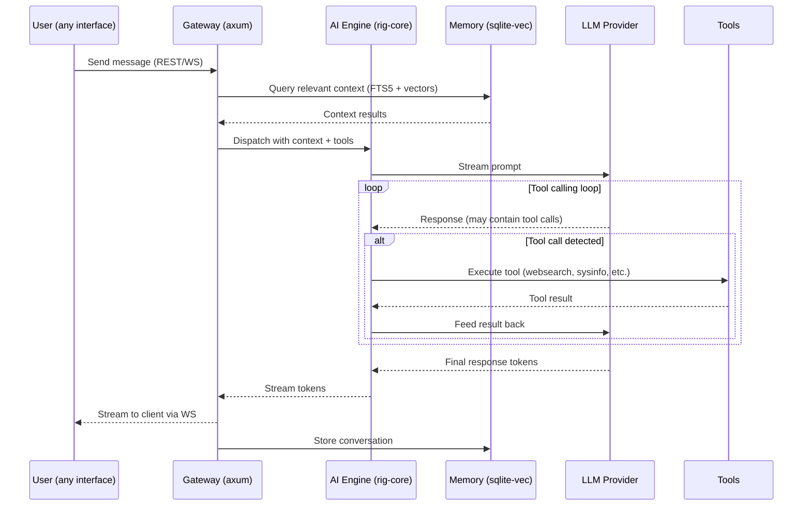
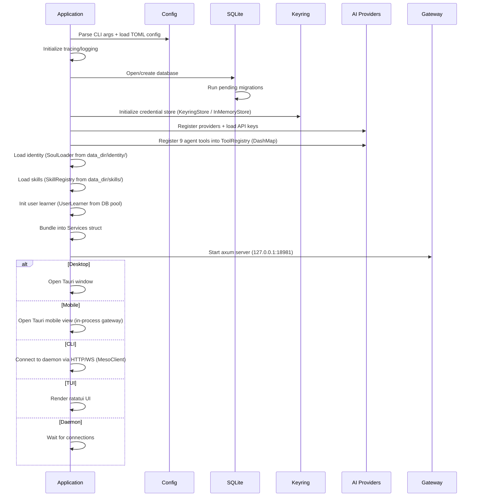
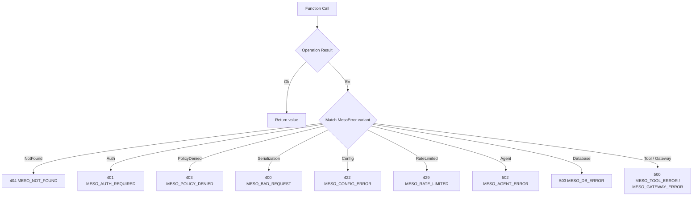
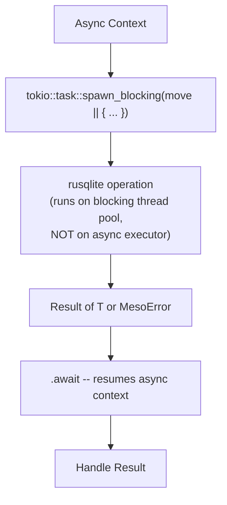
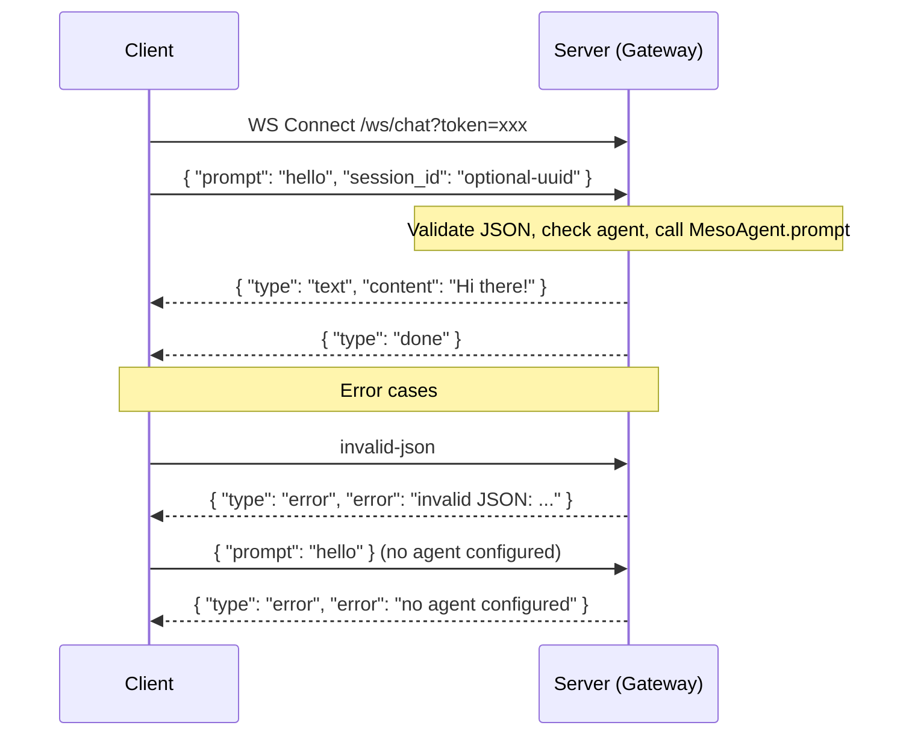
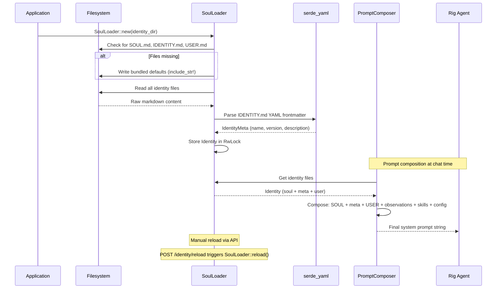
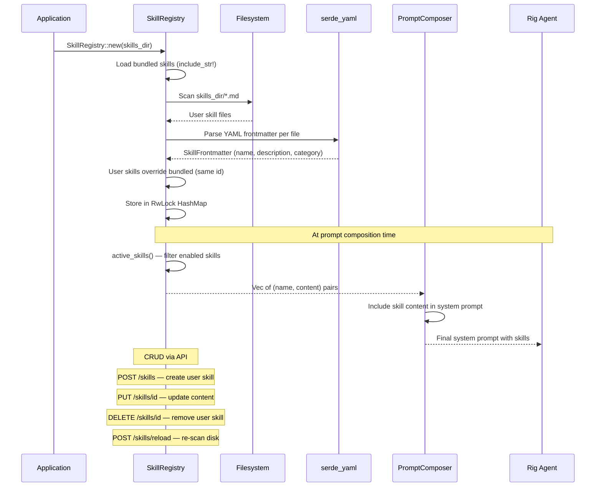
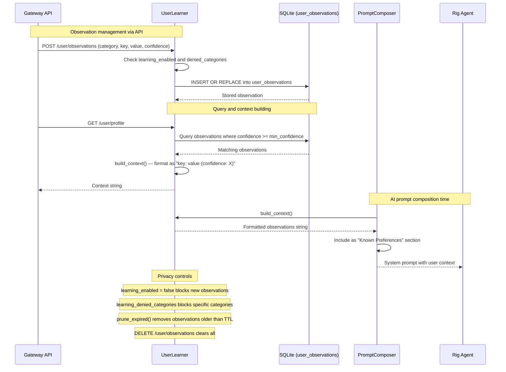
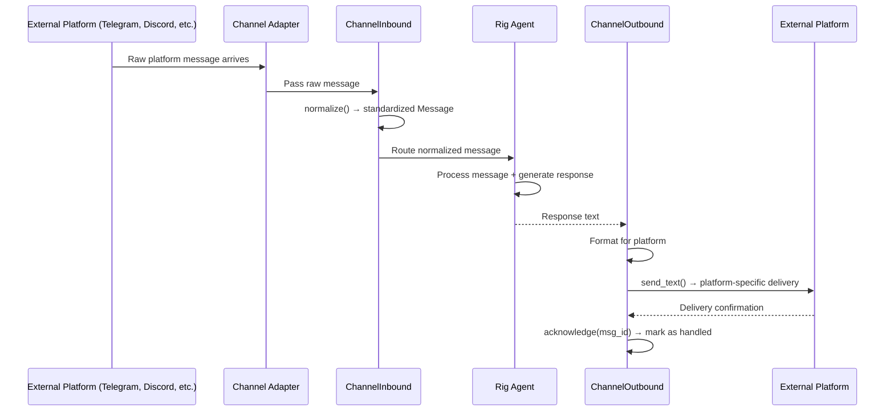
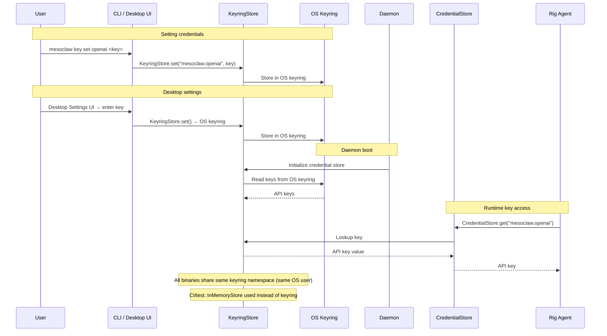

# MesoClaw Process Flows

## Table of Contents

- [Chat Request Flow](#chat-request-flow)
- [Startup Sequence](#startup-sequence)
- [Default Paths by OS](#default-paths-by-os)
- [Error Handling Flow](#error-handling-flow)
- [Database Operation Flow](#database-operation-flow-async-safe)
- [WebSocket Message Flow](#websocket-message-flow)
- [Identity Loading Flow](#identity-loading-flow)
- [Skill Loading Flow](#skill-loading-flow)
- [User Learning Flow](#user-learning-flow)
- [Channel Message Flow](#channel-message-flow)
- [Credential Flow](#credential-flow)

---

## Chat Request Flow



## Startup Sequence



## Default Paths by OS

Resolved via `directories::ProjectDirs::from("com", "sprklai", "mesoclaw")`:

| OS | Config Path | Data Dir / DB Path |
|---|---|---|
| **Linux** | `~/.config/mesoclaw/config.toml` | `~/.local/share/mesoclaw/mesoclaw.db` |
| **macOS** | `~/Library/Application Support/com.sprklai.mesoclaw/config.toml` | `~/Library/Application Support/com.sprklai.mesoclaw/mesoclaw.db` |
| **Windows** | `%APPDATA%\sprklai\mesoclaw\config\config.toml` | `%APPDATA%\sprklai\mesoclaw\data\mesoclaw.db` |

Override via `config.toml`:
```toml
data_dir = "/custom/data/path"        # overrides default data directory
db_path = "/custom/path/mesoclaw.db"  # overrides database file directly
```

## Error Handling Flow



## Database Operation Flow (async-safe)



## WebSocket Message Flow



## Identity Loading Flow



## Skill Loading Flow



## User Learning Flow



## Channel Message Flow



## Credential Flow


